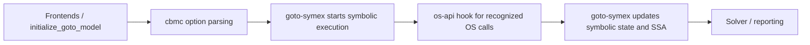
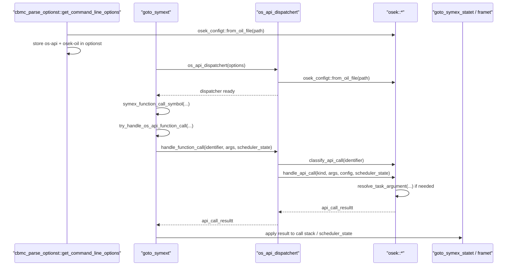
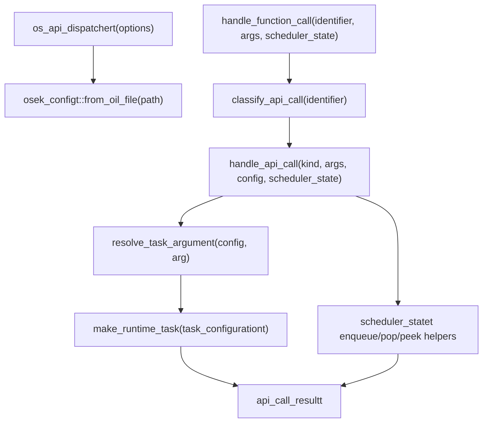

\ingroup module_hidden
\defgroup os-api os-api

# Folder os-api

This module collects operating-system API integrations that need to influence
symbolic execution without scattering scheduler logic throughout `cbmc/` and
`goto-symex/`.

## Structure

The module is split into two layers:

1. `core/` contains integration-neutral runtime data structures such as
   scheduler state and dispatcher result types.
2. `osek/` contains the first concrete implementation for OSEK task metadata,
   OIL parsing, and API classification/handling.

## Pipeline position

`os-api` is not a standalone top-level phase like parsing, `goto-program`
construction, `goto-symex`, or solving. Instead, it is a support module that
plugs into the boundary between `cbmc/` and `goto-symex/`.

In the current pipeline:

1. Frontends and `initialize_goto_model` build the GOTO model.
2. `cbmc/` parses command-line options and validates OS API configuration such
   as `--os-api osek --osek-oil <file>`.
3. `goto-symex/` starts symbolic execution of the transformed GOTO model.
4. During symbolic execution, `goto-symex/` delegates recognized OS API calls
   to `os-api/` to decide whether scheduling should continue, preempt, chain,
   or terminate a task.
5. `goto-symex/` applies that decision to the active symbolic state and
   continues building the SSA equation.
6. Solvers consume the resulting equation as usual.

So, in practical terms:

- `os-api` comes after command-line parsing and GOTO-model preparation.
- `os-api` sits inside the symbolic-execution stage, before solver input is
  finalized.
- `os-api` runs after generic function-call recognition in `goto-symex`, but
  before the normal "inline this callee like an ordinary function" path is
  taken for recognized OS API calls.

For the current OSEK integration this means:

- `cbmc/` owns option parsing and early configuration validation.
- `os-api/` owns API-specific metadata and scheduling policy.
- `goto-symex/` owns runtime application of those scheduling decisions.

## Function-level integration points

The current implementation touches three layers, each with a distinct role.

### 1. Entry from `cbmc/`

The first entry point is:

- `cbmc_parse_optionst::get_command_line_options` in
  `src/cbmc/cbmc_parse_options.cpp`

At this point CBMC:

1. checks whether `--os-api` was requested,
2. validates that `--osek-oil` is present for `--os-api osek`,
3. calls `os_api::osek::osek_configt::from_oil_file(...)` once for early
   validation,
4. stores the selected values into `optionst`.

This is an early configuration/validation step only. No scheduling decision is
made here yet.

### 2. Construction inside `goto-symex`

When symbolic execution is created, the next entry point is:

- `goto_symext::goto_symext(...)` in `src/goto-symex/goto_symex.h`

That constructor creates:

- `std::unique_ptr<os_api::core::os_api_dispatchert> os_api_dispatcher`

by calling:

- `os_api::core::os_api_dispatchert::os_api_dispatchert(const optionst &)`

Inside that constructor, `os-api` reloads the OSEK configuration from the
stored options so the dispatcher has runtime access to the parsed task table.

### 3. Runtime hook during symbolic execution

The main runtime hook is:

- `goto_symext::symex_function_call_symbol(...)` in
  `src/goto-symex/symex_function_call.cpp`

For ordinary function calls, this function would normally continue to:

- `goto_symext::symex_function_call_post_clean(...)`

However, before that normal inlining path is taken, it now calls:

- `goto_symext::try_handle_os_api_function_call(...)`

That is the precise point where `goto-symex` asks `os-api` whether the current
callee should be treated as a scheduler/API action rather than as a normal C
function body.

## Who calls whom

## How the result is used

`os-api` does not mutate the symbolic executor directly. Instead, it returns a
compact decision object:

- `os_api::core::api_call_resultt`

The key field is:

- `next_step_kindt`

The current outcomes are:

1. `CONTINUE_CURRENT_THREAD`
2. `START_TASK_NOW`
3. `POP_TASK_AND_RESUME_CALLER`
4. `POP_TASK_AND_START_TASK`

These results are consumed in:

- `goto_symext::try_handle_os_api_function_call(...)`

That function translates them into actual symbolic-execution actions:

- `symex_transition(state)` when execution should simply continue,
- `start_os_api_task(...)` when a new task should be started immediately,
- `symex_end_of_function(...)` when the current task should be terminated,
- or a combination of `symex_end_of_function(...)` followed by
  `start_os_api_task(...)` when chaining/rescheduling requires both.

There is one further consumption point after a task body naturally reaches
`END_FUNCTION`:

- `goto_symext::symex_end_of_function(...)`

That function now checks whether the frame being popped is an OS API task and,
if so, uses `state.scheduler_state` to decide whether another ready task should
start before control returns to the suspended caller frame.

## Internal `os-api` flow

For OSEK, the internal call chain is:

More concretely:

### Dispatcher layer

- `os_api_dispatchert::os_api_dispatchert(...)`
  loads the selected integration and its configuration.
- `os_api_dispatchert::handle_function_call(...)`
  routes a recognized API call to the active backend.

### OSEK classification layer

- `osek::classify_api_call(...)`
  maps a callee name such as `ActivateTask` or `TerminateTask` to an internal
  enum.

### OSEK metadata layer

- `osek_configt::from_oil_file(...)`
  parses the OIL subset into `task_configurationt` records.
- `resolve_task_argument(...)`
  converts the function-call argument into a runtime task by looking it up in
  the parsed task table.

### OSEK scheduling-policy layer

- `osek::handle_api_call(...)`
  is the main policy function.

Its behavior is:

1. For `ActivateTask`, resolve the target task, enqueue it, and decide whether
   it should start immediately.
2. For `TerminateTask`, remove the active task from scheduler state and choose
   whether to resume a caller or start the highest-priority ready task.
3. For `ChainTask`, remove the current task, enqueue the chained task, then
   reschedule.
4. For `Schedule`, perform an explicit reschedule decision without inventing a
   new task.

### Generic scheduler-state layer

- `scheduler_statet`
  stores:
  - the current active task,
  - suspended active-task stack information,
  - and the ready queue.

Its helpers such as:

- `enqueue_ready_task(...)`
- `pop_active_task()`
- `peek_highest_priority_ready_task()`
- `pop_highest_priority_ready_task()`
- `has_higher_priority_ready_task_than(...)`

are used by `osek::handle_api_call(...)` to produce an `api_call_resultt`.

## Runtime application inside `goto-symex`

When `goto-symex` receives the `api_call_resultt`, it applies it in two places:

### Function-call site

At the call site, `try_handle_os_api_function_call(...)` may:

1. keep executing the current frame,
2. inline a task body immediately via `start_os_api_task(...)`,
3. terminate the current task via `symex_end_of_function(...)`,
4. or terminate the current task and then start another one.

`start_os_api_task(...)` itself reuses the normal inlining machinery by calling:

- `symex_function_call_post_clean(...)`

with the selected task function symbol. After that, it annotates the new frame
with OS API task metadata such as task name, priority, and resume mode.

### End-of-function site

At natural task completion, `execute_next_instruction(...)` reaches:

- `goto_symext::symex_end_of_function(get_goto_function, state)`

That function:

1. pops the current symbolic frame,
2. checks whether it was an OS API task,
3. updates `scheduler_state`,
4. optionally starts the next ready task,
5. otherwise resumes the suspended caller frame at the correct location.

This split is important: `os-api` decides *what should happen next*, while
`goto-symex` decides *how to realize that decision in symbolic execution*.

## Current status

The module is now wired end-to-end for the first integration:

1. `cbmc` exposes `--os-api osek --osek-oil <file>`.
2. `os-api/core` loads configuration and owns scheduler bookkeeping.
3. `goto-symex` delegates recognized OSEK API calls through this module instead
   of inlining scheduler logic directly in the generic symex flow.

This keeps OS API selection, configuration loading, and scheduling decisions
behind one boundary instead of patching multiple unrelated folders directly.
