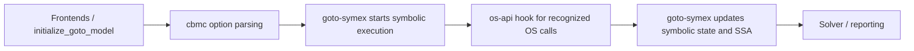

\ingroup module_hidden
\defgroup os-api os-api

# Folder os-api

This module collects operating-system API integrations that need to influence
symbolic execution without scattering scheduler logic throughout `cbmc/` and
`goto-symex/`.

## Structure

The module is split into two layers:

1. `core/` contains integration-neutral runtime data structures such as
   scheduler state and dispatcher result types.
2. `osek/` contains the first concrete implementation for OSEK task metadata,
   OIL parsing, and API classification/handling.

## Pipeline position

`os-api` is not a standalone top-level phase like parsing, `goto-program`
construction, `goto-symex`, or solving. Instead, it is a support module that
plugs into the boundary between `cbmc/` and `goto-symex/`.

In the current pipeline:

1. Frontends and `initialize_goto_model` build the GOTO model.
2. `cbmc/` parses command-line options and validates OS API configuration such
   as `--os-api osek --osek-oil <file>`.
3. `goto-symex/` starts symbolic execution of the transformed GOTO model.
4. During symbolic execution, `goto-symex/` delegates recognized OS API calls
   to `os-api/` to decide whether scheduling should continue, preempt, chain,
   or terminate a task.
5. `goto-symex/` applies that decision to the active symbolic state and
   continues building the SSA equation.
6. Solvers consume the resulting equation as usual.

So, in practical terms:

- `os-api` comes after command-line parsing and GOTO-model preparation.
- `os-api` sits inside the symbolic-execution stage, before solver input is
  finalized.
- `os-api` runs after generic function-call recognition in `goto-symex`, but
  before the normal "inline this callee like an ordinary function" path is
  taken for recognized OS API calls.

For the current OSEK integration this means:

- `cbmc/` owns option parsing and early configuration validation.
- `os-api/` owns API-specific metadata and scheduling policy.
- `goto-symex/` owns runtime application of those scheduling decisions.

## Current status

The module is now wired end-to-end for the first integration:

1. `cbmc` exposes `--os-api osek --osek-oil <file>`.
2. `os-api/core` loads configuration and owns scheduler bookkeeping.
3. `goto-symex` delegates recognized OSEK API calls through this module instead
   of inlining scheduler logic directly in the generic symex flow.

This keeps OS API selection, configuration loading, and scheduling decisions
behind one boundary instead of patching multiple unrelated folders directly.
